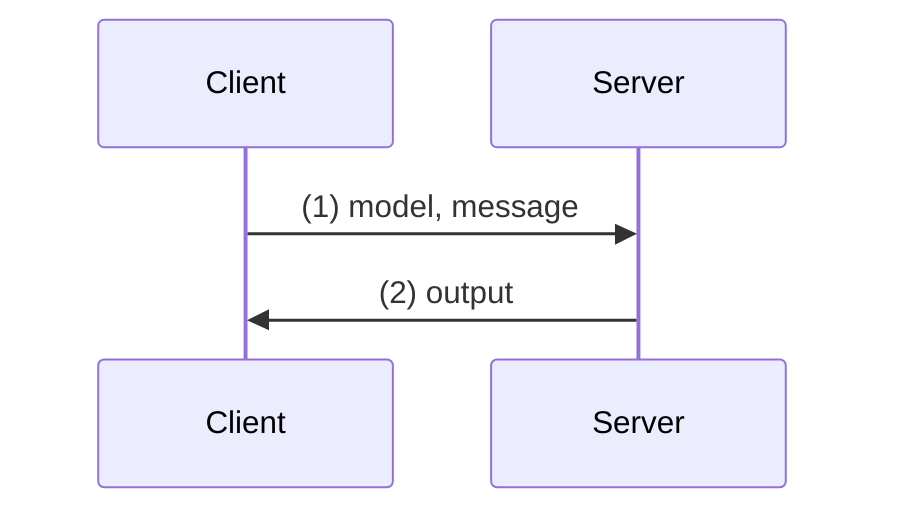
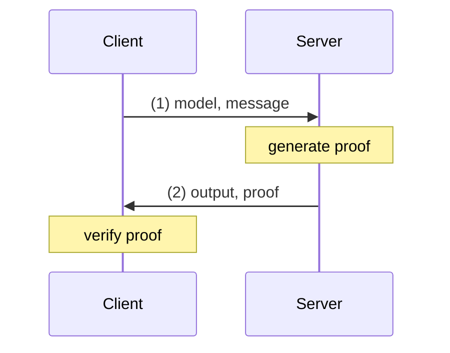
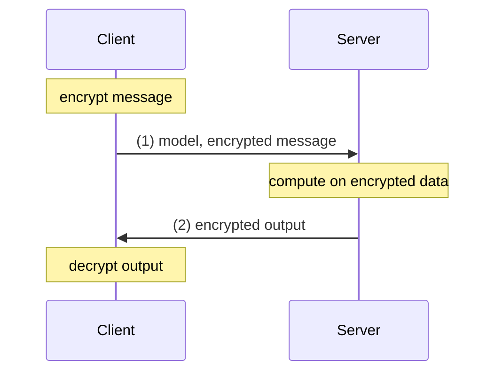
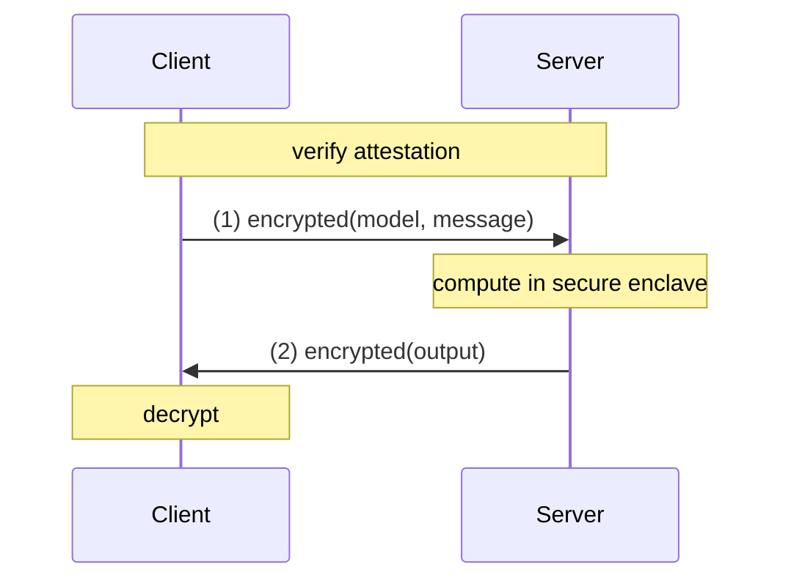

## Inference

```mermaid
%% the command below is needed for svg rendering in typst %%
%%{ init: { "htmlLabels": false, "sequenceDiagram": { "htmlLabels": false } } }%%

sequenceDiagram
  participant C as Client
  participant S as Server

  C->>S: (1) model, message
  S->>C: (2) output
```

## Inference with ZK

```mermaid
%% the command below is needed for svg rendering in typst %%
%%{ init: { "htmlLabels": false, "sequenceDiagram": { "htmlLabels": false } } }%%

sequenceDiagram
  participant C as Client
  participant S as Server

  C->>S: (1) model, message
  note over S: generate proof
  S->>C: (2) output, proof
  note over C: verify proof
```

## Inference with FHE

```mermaid
%% the command below is needed for svg rendering in typst %%
%%{ init: { "htmlLabels": false, "sequenceDiagram": { "htmlLabels": false } } }%%

sequenceDiagram
  participant C as Client
  participant S as Server

  note over C: encrypt message
  C->>S: (1) model, encrypted message
  note over S: compute on encrypted data
  S->>C: (2) encrypted output
  note over C: decrypt output
```

## Inference with TEE

```mermaid
%% the command below is needed for svg rendering in typst %%
%%{ init: { "htmlLabels": false, "sequenceDiagram": { "htmlLabels": false } } }%%

sequenceDiagram
  participant C as Client
  participant S as Server

  note over C, S: verify attestation
  C->>S: (1) encrypted(model, message)
  note over S: compute in secure enclave
  S->>C: (2) encrypted(output)
  note over C: decrypt
```
