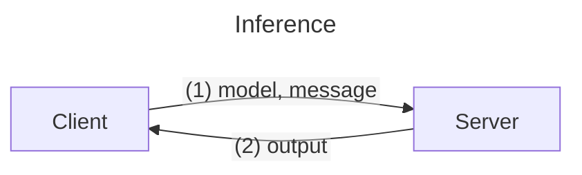

```mermaid
---
title: Inference
---
%%{ init: { "htmlLabels": false, "flowchart": { "htmlLabels": false } } }%%

flowchart LR
    C[Client]
    S[Server]

    C -- (1) model, message --> S
    S -- (2) output --> C
```
